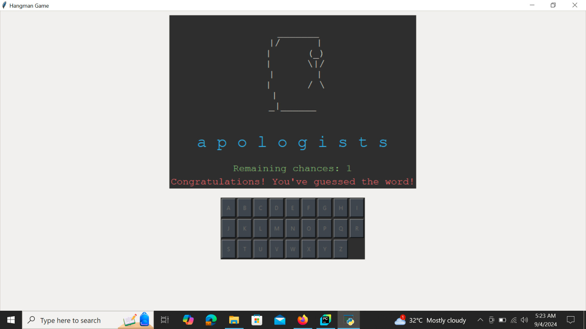

# Hangman Game 🎮

## Overview
The Hangman Game is a classic word-guessing game implemented in Python, featuring a graphical user interface (GUI) built with Tkinter. This game offers a fun and interactive way to challenge your vocabulary skills, with a dynamic visual representation of the hangman that evolves with each wrong guess.

## Features
- **Random Word Generation:** Utilizes the `random-word` Python package to generate a new word each game, ensuring a unique experience every time.
- **Interactive GUI:** A user-friendly interface designed with Tkinter, including a virtual keyboard for letter selection and real-time visual updates.
- **Dynamic Hangman Visualization:** The hangman drawing updates progressively with each incorrect guess, creating a visually engaging experience.
- **Modern Aesthetics:** The interface is enhanced with a sleek, modern color scheme, improving the visual appeal of the game.

## Installation

### Prerequisites
- Python 3.x
- `random-word` package

### Installation Steps
1. Clone the repository:
    ```bash
    git clone https://github.com/yourusername/hangman-game.git
    ```
2. Navigate to the project directory:
    ```bash
    cd hangman-game
    ```
3. Install the required packages:
    ```bash
    pip install random-word
    ```
4. Run the game:
    ```bash
    python hangman.py
    ```

## How to Play
1. The game begins by displaying a series of underscores representing the letters of a randomly chosen word.
2. Click on the letters in the virtual keyboard to guess them.
3. Correct guesses will reveal the letters in their respective positions; incorrect guesses will progress the hangman drawing.
4. The game ends when the word is fully guessed, or when the hangman is completely drawn after seven incorrect guesses.

## Screenshots

Here is a screenshot of the Hangman Game in action:




## Contributing
Contributions to improve the game or add new features are welcome! Please fork the repository and create a pull request for any changes you'd like to contribute.

## License
This project is licensed under the MIT License. See the [LICENSE](LICENSE) file for more details.
